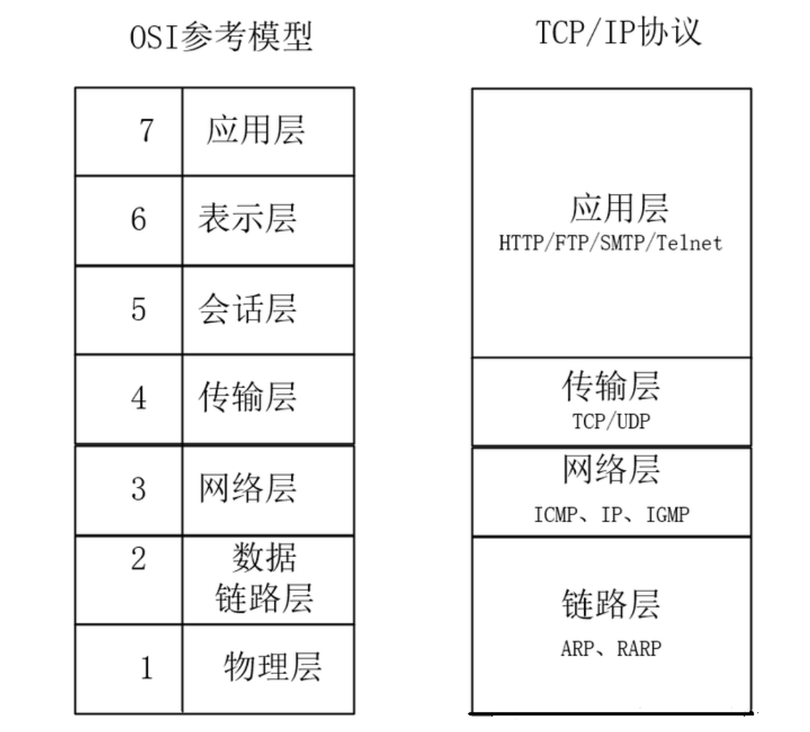
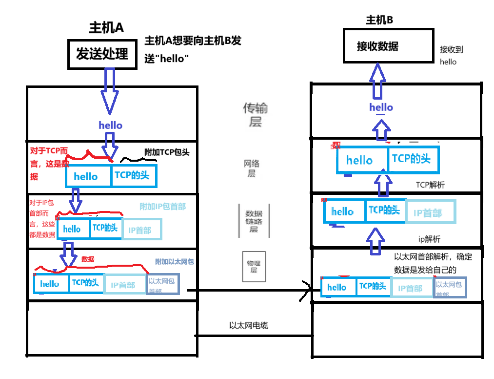

[TOC]

#### 一.tcp/ip的由来

2次世界大战后，美苏冷战，美国国防部想开发一个在恶劣情况下两台计算机仍然可以互相通讯的网络;
1969，阿帕网主要用于军事，同时，民间机构也在研究自己专属的网络，当民间的网络分支越来越多，想法萌生： **将小的局域网扩大，互相通讯**。
1972，华盛顿召开会议，决定制定一套通用的网络通讯协议；
1974，美国国防部推出tcp/ip的通讯协议，免费共享出来，开源。
慢慢的，民间机构也使用tcp/ip协议，渐渐形成了英特网

#### 二.tcp/ip是什么？

TCP/IP（传输控制协议/网间协议）是一种网络通信协议，它规范了网络上的所有通信设备，尤其是一个**主机与另一个主机之间的数据往来格式以及传送方式**。

TCP/IP 是利用IP进行通信时所必须用到的协议群的统称，它不是一个独立的协议，而是一组协议（tcp[传输控制协议]，ip[Internet协议]，udp[用户数据包协议]，arp[地址解析协议]，rarp[反地址解析协议]等协议）。TCP/IP协议族提供了点对点的连结机制，并且将传输数据帧的封装、寻址、传输、路由以及接收方式，都予以标准化。

#### 三.TCP/IP分层架构

TCP/IP协议与七层ISO模型的对应关系，大致如下图所示：

TCP/IP协议是Internet互联网最基本的协议，一定程度上参考了七层ISO模型。OSI模型共有七层，但是这显然是有些复杂的，在TCP/IP协议中，七层被简化为了四个层次。TCP/IP模型中的各种协议，依其功能不同，被分别归属到这四层之中，常被视为是简化过后的七层OSI。

- **应用层**：为网络应用提供服务，如HTTP用于网页浏览、FTP用于文件传输、SMTP用于邮件发送等.
- **传输层**：主要有TCP和UDP协议。TCP提供可靠的、面向连接的数据传输服务；UDP提供无连接、不可靠但高效的数据传输服务，适用于实时性要求高的应用.
- **网络层**：核心是IP协议，负责为数据包选择路由，将数据包从源地址传输到目的地址。此外还有ARP、RARP、ICMP等协议，分别用于地址解析和网络控制等功能.
- **网络接口层**：负责数据帧的发送和接收，涉及实际的网络硬件和链路，如以太网、Wi-Fi等.

#### 四. 协议基础

- **IP协议**：为网络中的设备分配唯一的IP地址，进行数据包的路由、分片和重组，使数据能够在不同网络间传输.
- **TCP协议**：在IP协议基础上，通过建立连接、数据传输、流量控制和拥塞控制等机制，确保数据准确无误地按顺序从源地址传输到目的地址.
- **UDP协议**：无连接、不可靠的传输层协议，不保证数据包的到达顺序和正确性，但具有传输速度快的特点，适用于实时视频、音频传输和网络游戏等对实时性要求高的场景.

#### 五. 数据封装与解封装

数据发送时，从应用层开始依次向下封装，每层添加相应的头部或尾部信息，形成最终的数据包在网络中传输；接收方则从网络接口层开始依次向上解封装，提取出原始数据.

#### 六.地址解析

​	包括域名解析和ARP解析。域名解析将域名转换为对应的IP地址，以便在网络中找到目标设备；ARP解析则用于将IP地址转换为MAC地址，以实现数据链路层的通信.

#### 七.tcp/ip总结

通俗讲，tcp/ip将计算机通讯划分成四个层次，并规定了每个层次干什么有什么规定，它让不同网络设备互联，确保数据准确传输，支撑多样网络应用，推动互联网发展。
